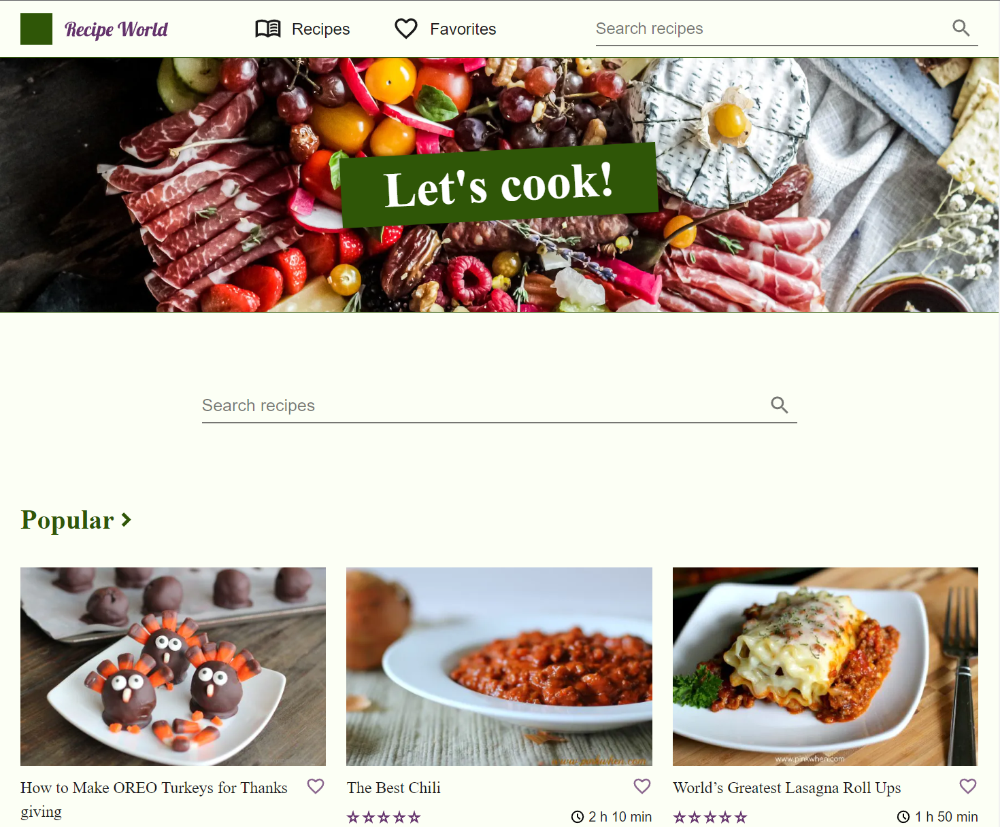

# Recipe World

## **WIP**

https://recipe-world-one.vercel.app/

Practice project.

Recipe website displaying recipes from [Spoonacular](https://spoonacular.com/) utilizing the [Spoonacular API](https://spoonacular.com/food-api).

Due to using the free tier, the daily API points may run out quickly.

**Main tech used:**

- React
- Next.js
- Styled Components
- TypeScript

Designed with Figma. [Link to the file](https://www.figma.com/file/BTgLWRkoLmgfRAovIeBoTy/Recipe-World?node-id=0%3A1&t=9urMt9d1YrXairbH-1).